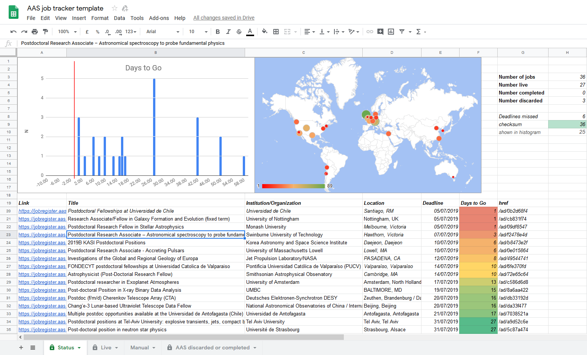
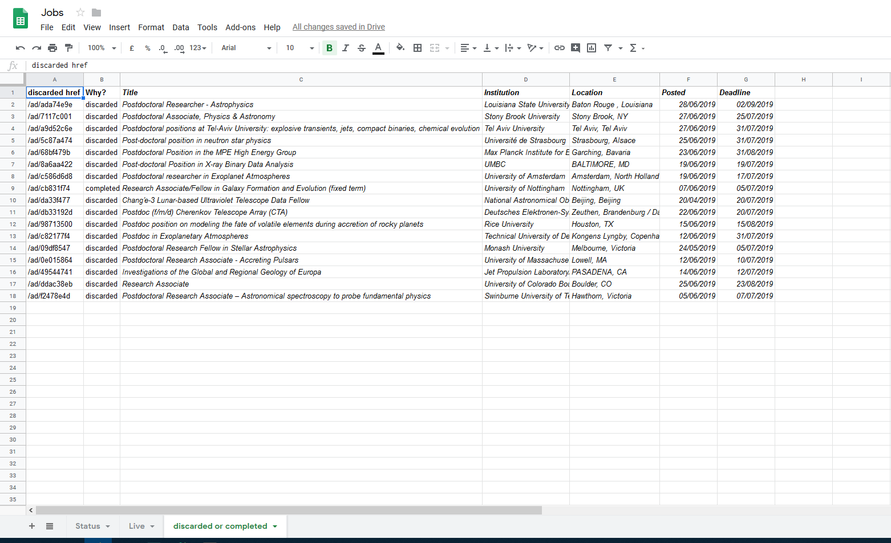

# AAS Job Hunter

Organise jobs from the [AAS website](https://jobregister.aas.org) with the help of Google Sheets.

### Features:

* Email notifications for new jobs every day
* See when your deadlines are approaching 
* Keep track of discarded or complete applications 
* Integrate with [travis-ci](http://travis-ci.com) to automatically keep your database up to date
* No pesky to-do lists or heavy websites to host
* Add your own jobs manually to the list to see everything in one place

## 1. Installation
1. Fork this repository
1. Make a copy of the spreadsheet [here](https://docs.google.com/spreadsheets/d/1Ns2YIzKOQusU_3RDMPKFgdVe8OBYcDvO85fu3DicvME/edit?usp=sharing)
(not updated)
1. Save the `SPREADSHEET_ID` as an environment variable
1. Save the required `MAILGUN` environment variables for notifications (or modify that bit)
1. run `python sheets.py` to get authorised with google (it will tell you what to do). This produces a `token.pickle` file which is secret and **must not be commited to git!**
1. run `python run.py` to update the google sheet!

#### 2. Travis integration
1. Sign up to travis-ci and integrate your github account
1. Set the `SPREADSHEET_ID`, `MAILGUN_DOMAIN`, `MAILGUN_API_KEY`, `EMAIL_ADDRESS` environment variables you used above as secret keys in travis settings
1. run `gem install travis`
1. run ` travis encrypt-file token.pickle [--pro]`
1. Update the .travis.yml file like it tells you. Something like `openssl aes-256-cbc -K $encrypted_040c7bfba308_key -iv $encrypted_040c7bfba308_iv -in token.pickle.enc -out token.pickle -d`
1. Commit the changes in `.travis.yml` and the new `token.pickle.enc` file, **not the original `token.pickle` or `credential.json` files!**.
1. Set cron job in travis settings to run every day

Done! 
